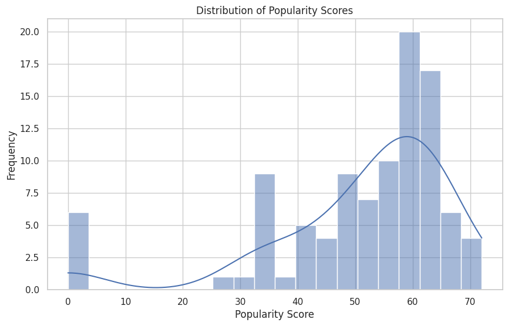

# Statistical modelling 
It is a form of mathematical modelling that involves statistics to estimate or predict real-world behaviours, trends, and future outcomes based on data. It involves the construction of a statistical model, which is a formal representation of relationships between variables, typically expressed in the form of mathematical equations. 

## What is Statistical Modelling? And How It’s Different From Machine Learning Model Training?
Statistical modelling is a mathematical framework used to describe the relationships between variables in the form of equations, usually involving stochastic elements (randomness). It is primarily focused on inference, which means understanding the relationships between variables and quantifying how certain factors influence outcomes.

Statistical models are built based on assumptions about the data distributions and the nature of the relationships between variables. Common examples include linear regression, logistic regression, and analysis of variance (ANOVA).

The difference between statistical modelling and machine learning model training is that statistical modelling is primarily concerned with inference. It seeks to understand the underlying relationships between variables and to quantify how predictors influence the response variable. It often tests hypotheses about these relationships.

Whereas Machine Learning model training focuses on prediction. The primary goal is to create models that can make accurate predictions on new, unseen data. Machine learning often cares less about the ‘why’ of the data relationships and more about the ‘how well’ it can predict the outcome.

## Statistical Modelling of music features using Python
Aim is to identify what music features determine the popularity of music tracks.

### Dataset:
Dataset using here is from 'Statso'.
Statso is a Data Science Community to Find Case Studies, Datasets and more!

### 1. Getting started
- Import necessary libraries
- Load the dataset

### 2. Let’s have a look at the column info and summary statistics before moving forward: 
- music_data.info()
- print(music_data.describe())
  
I noticed an unnamed column. Before removing it, let’s have a look at whether the data has null values or not:
- music_data.isnull().sum()

### 3. Data cleaning
- Dropping the 'Unnamed: 0' column
- Handling missing values by filling them with placeholder text

The data is now cleaned, and all missing values have been handled:

The unnecessary Unnamed: 0 column has been removed.
Missing values in the Track Name, Artists, and Album Name columns have been filled with “Unknown”.
Now, let’s examine the distribution of the Popularity score and then look at correlations between Popularity and other musical features. We’ll generate some plots to visualize these aspects:
- Plotting the distribution of popularity

The distribution of popularity scores shows a range mainly between 40 to 70, with peaks around the 50s and 60s. This indicates that most tracks in this dataset have moderate to high popularity.

Now, let’s have a look at the correlation matrix:

The heatmap provides insights into how various features are related to each other and the popularity of the tracks. Notably, Popularity seems to have some level of positive correlation with Loudness and Energy, while it has slight negative correlations with Acousticness. This suggests that louder and more energetic tracks tend to be more popular, while more acoustic tracks tend to be less popular.

Danceability and Valence (the musical positiveness conveyed by a track) also show some positive correlation with popularity, indicating that tracks that are more danceable and have a happier tone might be preferred by listeners.

Now, let’s delve into the individual feature impacts on the popularity of music tracks. We’ll focus on several key features based on our initial observations from the correlation matrix. Specifically, we’ll analyze:
- Danceability vs. Popularity
- Energy vs. Popularity
- Loudness vs. Popularity
- Acousticness vs. Popularity
- Valence vs. Popularity
  
For each of these features, we’ll create scatter plots to visualize their relationship with popularity. This will help us understand how each feature might influence the popularity of a track:
- Creating scatter plots for various feature

